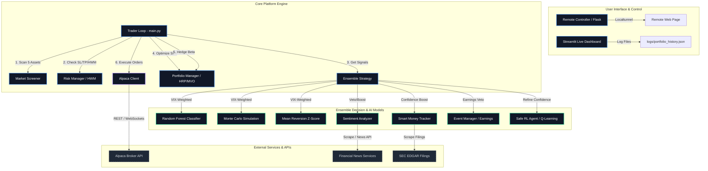

# Autonomous Multi-Manager Trading Platform (Mini AI Hedge Fund)

An autonomous, multi-agent algorithmic trading system designed for real-time market analysis, automated portfolio execution, and risk management. The platform runs a daily asset scanning universe, executes a volatility-aware ensemble of machine learning and mathematical models, dynamically optimizes capital allocation using advanced modern portfolio theory (MVO/HRP), hedges market beta using index positions, and monitors trade risk with institutional safeguards. It features a Streamlit-based live performance dashboard and a Flask-based remote control server exposed via secure local tunnels.

---

## System Architecture

The following diagram illustrates the flow of data, decisions, and execution across the multi-agent framework:



---

## Key Features

### 1. Multi-Manager Decision Ensemble
The decision engine (`EnsembleStrategy`) evaluates signals using multiple independent approaches:
*   **Machine Learning (Random Forest)**: An optimized classifier trained on advanced technical indicators (RSI, EMA cross, ADX, Williams %R, MACD, Bollinger Bands) using time-series split cross-validation to avoid look-ahead bias.
*   **Mathematical simulation (Monte Carlo)**: Simulates thousands of price trajectories to project the statistical probability of a positive outcome.
*   **Mean Reversion**: Uses Bollinger Bands z-scores and RSI confirmations to capture ranging market swings.
*   **Sentiment Co-pilot**: Multi-tier weighted sentiment analyzer (weighting high-trust outlets like Bloomberg/WSJ higher than general news) that boosts buy confidence or executes **hard vetoes** under extreme negative sentiment.
*   **Smart Money Tracker**: Analyzes SEC EDGAR filings for insider transaction clusters to reinforce conviction.
*   **Earnings Guardian**: Uses the `EventManager` to block new entries and exit existing holdings ahead of upcoming earnings releases.

### 2. Reinforcement Learning Advisor (`SafeRLAgent`)
*   Uses a simplified, discretized **Q-Learning agent** acting as a risk-adjustment advisor.
*   Refines signal confidence by studying historical reward signals (+1/-1) based on realized trade outcomes.
*   Constrained by strict safety parameters to ensure Q-learning adjustments do not override the baseline model decisions, acting strictly as a confidence fine-tuner.

### 3. Advanced Portfolio Management & Sizing
*   **Hierarchical Risk Parity (HRP)**, **Risk Parity**, or **Mean-Variance Optimization (MVO)**: Allocates capital based on covariance and volatility signatures of the selected universe.
*   **Beta-Neutral Hedging**: Calculates dollar-weighted portfolio beta relative to the S&P 500 and dynamically hedges the net systematic risk by shorting/buying `SPY`.
*   **Sector Exposure Guard**: Imposes strict caps on individual sector allocations to prevent correlation cluster risk.

### 4. Dynamic Risk Safeguards
*   **ATR-Based Stops**: Stop loss (e.g., $1.5 \times ATR$) and take profit (e.g., $3.0 \times ATR$) limits adapt dynamically to historical asset volatility.
*   **Partial Take Profit Scale-outs**: Volatility-aware take profit levels scaling out positions based on current VIX regimes (e.g., banking 75% in high-VIX environments, letting 70% run in calm markets).
*   **High-Water Mark Trailing Stop**: A trailing stop that automatically tracks asset peak/trough levels to lock in profits.
*   **Portfolio Drawdown Circuit Breaker**: Liquidates all active positions and triggers a system-wide **Lockdown** if the portfolio drawdown from peak equity exceeds the predefined threshold (e.g., 5%).
*   **Market Open Protection**: Restricts entry orders during the volatile opening 30 minutes (9:30 AM - 10:00 AM EST) and tightens trailing stops to capture morning gaps.

### 5. Automated Optimization (`PortfolioTuner`)
*   An asynchronous Bayesian/UCB hyperparameter optimizer that continuously monitors closed trades.
*   Learns from execution outcomes to fine-tune sentiment weights, trading thresholds, and ATR multipliers.

---

## Project Directory Structure

```bash
├── config.py                 # System hyperparameters, risk settings, and sentiment weights
├── config_tickers.py         # Standard universes and watchlists (e.g., technology, energy, indices)
├── main.py                   # Main loop entry point (starts the Trader)
├── dashboard.py              # Streamlit dashboard script for real-time visualization
├── remote_controller.py      # Flask REST API server for starting/stopping the platform remotely
├── start_remote.bat          # Command script initiating the controller and exposing it via Localtunnel
├── strategy/                 
│   ├── ensemble_strategy.py  # Main ensemble voter, Random Forest, Safe RL Agent
│   ├── lstm_model.py         # PyTorch LSTM network architecture for deep sequence learning
│   ├── monte_carlo.py        # Monte Carlo price trajectory simulator
│   ├── portfolio_tuner.py    # Self-tuning parameter meta-learner
│   ├── sentiment_analyzer.py # News scraping & sentiment weighting agent
│   └── smart_money_analyzer.py # SEC filings & insider transactions tracker
├── trading/                  
│   ├── alpaca_client.py      # SDK interface for Alpaca (Brokerage Connection)
│   ├── data_logger.py        # JSON lifecycle data aggregator
│   ├── event_manager.py      # Earnings calendars and event checker
│   ├── hwm_manager.py        # Peak tracker for trailing stops
│   ├── macro_manager.py      # Global macroeconomic bias analyzer
│   ├── market_regime.py      # VIX and volatility regime state detector
│   ├── portfolio_manager.py  # Portfolio optimizer (MVO, Risk Parity, HRP) and Beta Hedger
│   ├── screener.py           # Technical/fundamental/sentiment scanner for asset selection
│   ├── sector_manager.py     # Sector mapping and concentration constraints manager
│   └── trader.py             # Scheduler loops, order router, and risk manager
├── templates/                # Remote controller HTML pages
├── tests/                    # Robust unit, integration, and logic verification tests
├── requirements.txt          # Python library dependencies
└── models/                   # Persisted machine learning weights, Q-tables, and tuned parameters
```

---

## Configuration & Tunables

All key operational values are stored in [config.py](file:///c:/Users/shiva/OneDrive/quant_projects/mini_hedge_fund/config.py). Key parameters include:

| Parameter Category | Name | Default Value | Description |
| :--- | :--- | :--- | :--- |
| **Risk Management** | `ENABLE_RISK_MANAGER` | `True` | Master switch for SL/TP checks |
| | `USE_ATR_BASED_RISK` | `True` | Enable volatility-adaptive stops |
| | `MAX_PORTFOLIO_DRAWDOWN`| `0.05` (5%) | Draws a hard line for full liquidation and lockdown |
| | `ENABLE_PARTIAL_TP` | `True` | Scale out of winning positions dynamically |
| **Execution Sizing** | `ALLOCATION_STRATEGY` | `"HRP"` | Method to allocate capital (`"MVO"`, `"RISK_PARITY"`, `"HRP"`) |
| | `MARGIN_BUFFER_PCT` | `0.05` (5%) | Cash reserves held back for buffer safety |
| **Ensemble Logic** | `CONFIDENCE_THRESHOLD_BUY`| `0.55` | Signal conviction needed to enter a Long position |
| | `CONFIDENCE_THRESHOLD_SELL`| `0.45` | Signal conviction needed to enter a Short position |
| | `MIN_CONFIDENCE_GAP` | `0.10` | Minimum deviation from neutral `0.50` required to trade |
| **Volatility Guard** | `VIX_THRESHOLD_HIGH` | `25.0` | VIX level where dynamic signal gaps scale up |
| | `DYNAMIC_GAP_MULTIPLIER`| `1.5` | Signal requirements multiplier during high volatility |
| **Open Market Guard**| `MARKET_OPEN_DURATION_MINS`| `30` | Minutes to restrict entries post-market open (9:30 AM EST) |

---

## Getting Started

### Prerequisites
1. **Python 3.8+**
2. **Node.js** (required to run Localtunnel in `start_remote.bat`)
3. **Alpaca Brokerage Account** (Paper or Live API keys)

### Installation

1. Clone the repository:
   ```bash
   git clone https://github.com/falkenmaze/Autonomous-multi-manager-trading-platform.git
   cd Autonomous-multi-manager-trading-platform
   ```

2. Create and activate a virtual environment:
   ```bash
   python -m venv .venv
   # Windows:
   .venv\Scripts\activate
   # Linux/macOS:
   source .venv/bin/activate
   ```

3. Install required Python packages:
   ```bash
   pip install -r requirements.txt
   ```

4. Create your `.env` file based on the template:
   ```bash
   cp .env.example .env
   ```
   Fill in your credentials in `.env`:
   ```env
   APCA_API_KEY_ID=your_alpaca_key
   APCA_API_SECRET_KEY=your_alpaca_secret
   APCA_API_BASE_URL=https://paper-api.alpaca.markets
   ```

---

## Testing

The codebase includes an extensive suite of unit and integration tests under the `/tests` directory. To run all verification scripts:
```bash
python -m unittest discover -s tests -p "test_*.py"
```

---

## ⚠️ Disclaimer
*This software is created for educational and research purposes. Algorithmic trading involves substantial risk of loss and is not suitable for every investor. Backtested or paper-trading results are not indicative of future live performance. Use this software at your own discretion.*
